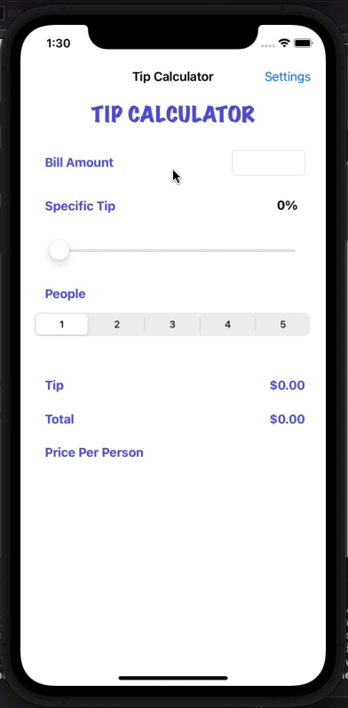

# Pre-work - *TIP CALCULATOR*

**Tip Calculator** is a tip calculator application for iOS.

Submitted by: **Adnaan Syed**

Time spent: **10-12** hours spent in total

## User Stories

The following **required** functionality is complete:

* [x] User can enter a bill amount, choose a tip percentage, and see the tip and total values.
* [x] User can select between tip percentages and the tip value is updated accordingly

The following **optional** features are implemented:

* [x] UI animations
* [ ] Remembering the bill amount across app restarts (if <10mins)
* [ ] Using locale-specific currency and currency thousands separators.
* [ ] Making sure the keyboard is always visible and the bill amount is always the first responder. This way the user doesn't have to tap anywhere to use this app. Just launch the app and start typing.

The following **additional** features are implemented:

- [x] Implementation of a new navigation controller, with an additonal Settings View in the application
- [x] Created a UISlider, allowing a user to pick a specific tip percentage, whose numeric form can be seen on a UILabel
- [x] Created a UISegmentedControl, which allows users to split the bill up to 5 people. 
- [x] Added a UISwitch in the Settings View, which allows a user to use the application in Dark Mode or Light Mode

## Video Walkthrough

Here's a walkthrough of implemented user stories:

## Notes

I did not have any prior experience with Swift, but I was familiar with similar languages, such as JavaScript and Python. The initial requirements
were simple because of the guided instructions offered. Yet implementing the additional features was not as intuitive because I had to do my own 
research. 

For the additional features, StackExchange, Swift blogs, and the official Apple "Develop in Swift: Fundamentals" helped alot with understanding 
how to use multiple views in one app and the different characterstics of different outlets. 

This was overall a fun experience, which allowed me to create something functional and have fun with some UI/UX design.

## License

    Copyright [2022] [Adnaan Syed]

    Licensed under the Apache License, Version 2.0 (the "License");
    you may not use this file except in compliance with the License.
    You may obtain a copy of the License at

        http://www.apache.org/licenses/LICENSE-2.0

    Unless required by applicable law or agreed to in writing, software
    distributed under the License is distributed on an "AS IS" BASIS,
    WITHOUT WARRANTIES OR CONDITIONS OF ANY KIND, either express or implied.
    See the License for the specific language governing permissions and
    limitations under the License.
